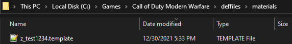
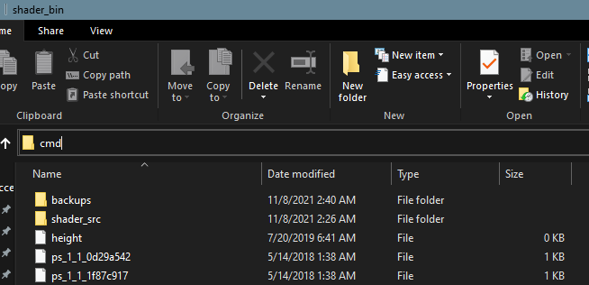
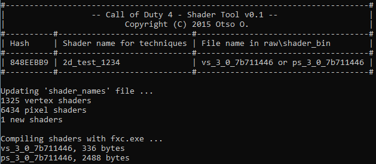
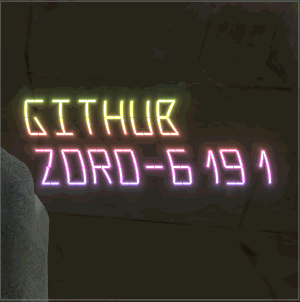

# 2D Shader UI Components for COD4

This repo contains all of my 2D HLSL UI Components that I've created.
Some of these shaders eat FPS.

This was taught to me by @xoxor4d. The source is mostly his, I only did copying and editing except the .hlsl files.


# How does it Work?

These shaders use [HLSL](https://docs.microsoft.com/en-us/windows/win32/direct3dhlsl/dx-graphics-hlsl), although I only converted open-source GLSL Shaders to HLSL from [here](https://glslsandbox.com/). [Here's](https://xoxor4d.github.io/tutorials/) a in-depth tutorial by @xoxor4d.

Basically, you create a regular material from Asset Manager, but give it special properties. It is possible to use any number of shaders in just 1 material.

Hierarchy:

`2d-mats.gdt`
    > `cod4/deffiles/materials/(file).template` > `raw/techset/(file).techset` and `raw/techset/sm2/(file).techset` (both files are usually same)
    > `raw/techniques/(file).tech`
    > `raw/shader_bin/shader_src/ps_3_0_(shadername).hlsl` and `raw/shader_bin/shader_src/vs_3_0_(shadername).hlsl` compiled using `raw/shader_bin/shader_tool.exe`
    > `raw/shader_bin/(ps and vs file pair)`

File names are generally not important, except when compiling .hlsl file pair from `raw/shader_bin/shader_src`. They must contain `ps_3_0_(name).hlsl` and `vs_3_0_(name).hlsl`

# How to Install

Let's say you just need 1 of the shader materials named `test_1234`, this is how you compile and use it:

- Be sure that you have [Modtools](https://github.com/promod/CoD4-Mod-Tools) properly installed.
- Copy and Paste `deffiles/materials/z_test_1234.template`
    
- Copy and Paste `2d-mats.gdt` to `cod4/source_data/` (recommended)
- Open `cod4/source_data/2d-mats.gdt`
- Select `test_1234` from left pane

    
- Hit <kbd>F10</kbd> to compile and create materials
- Check if `raw/materials/test_1234` exists

Just having the materials won't work. You need to have required files in folders `statemaps, techsets, techsets/sm2, techniques` and must compile .hlsl file pair in `raw/shader_bin/shader_src`

- Copy and Paste `raw/statemaps/default2d_alpha.sm`
- Copy and Paste `raw/techsets/hud_test_1234.techset` and `raw/techsets/sm2/hud_test_1234.techset`
- Copy and Paste `raw/techniques/tech_test_1234.tech`
- Copy and Paste `raw/shader_bin/shader_src/ps_3_0_2d_test_1234.hlsl` and `raw/shader_bin/shader_src/vs_3_0_2d_test_1234.hlsl`

Now compile .hlsl file pairs

- Go to `raw/shader_bin/`
- Click on address bar
- Type `cmd` and press <kbd>Enter</kbd>
    
- Type `shader_tool 2d_test_1234` and hit <kbd>Enter</kbd>
- It should show something like this:
    

Now you can compile your mod/map and compilation should be successful.
If it's unsuccessful, check if you have pasted files correctly.


>Test it in-game:
```
itemDef
{
    rect			50 0 200 200 HORIZONTAL_ALIGN_CENTER VERTICAL_ALIGN_CENTER
    style			WINDOW_STYLE_SHADER
    forecolor		1 1 1 1
    background		"test_1234"
    border			1
    bordercolor		0.5 0.5 0.5 0.5
    visible			1
}
```
Should look exactly like this:

