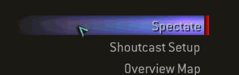
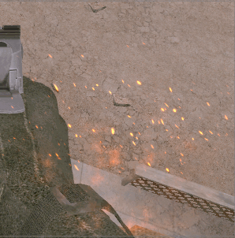
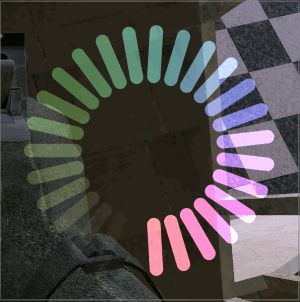

# 2D Shader UI Components for COD4

This repo contains all of my 2D HLSL UI Components that I've created.
Some of these shaders eat FPS.
(I have yet to upload all of them, doing one by one)

https://user-images.githubusercontent.com/52291201/147763164-a512a111-48d6-40ad-8029-a6300c119782.mp4

This was taught to me by @xoxor4d. The source is mostly his, I only did copying and editing except the .hlsl files.

## How does it Work?

[Wiki](https://github.com/Zoro-6191/cod4-2d-shaders/wiki/How-does-it-work%3F)

## How to Install All Shaders at once?

I don't recommend doing this coz of a weird glitch (which I'll try to fix). 

- Be sure that you have [Modtools](https://github.com/promod/CoD4-Mod-Tools) properly installed.
- Copy and Paste whole `raw/` folder to `cod4/raw/`
- Go to `cod4/raw/shader_bin/shader_src/` and run `compile.bat`

> You should now be able to use those materials in your mod/map.

## How to Install just one shader?

[Wiki](https://github.com/Zoro-6191/cod4-2d-shaders/wiki/How-to-Install-1-shader)

# Shader Previews

Named after their Material name and in alphabetical order.

- ##  <strong>`button1`</strong>

    

- ##  <strong>`button2`</strong>

    

- ##  <strong>`button3`</strong>

    

- ##  <strong>`fire_bg`</strong>

    

- ##  <strong>`fire_particles`</strong>

    

- ##  <strong>`loadcircle1`</strong>

    

- ##  <strong>`loadcircle21`</strong>

    

- ##  <strong>`misc1`</strong>

    

- ##  <strong>`misc2`</strong>

    

- ##  <strong>`misc3`</strong>

    

- ##  <strong>`sick_bg1`</strong>

    

- ##  <strong>`sick_bg2`</strong>

    

- ##  <strong>`sick_bg3`</strong>

    

- ##  <strong>`sick_bg4`</strong>

    

- ##  <strong>`sick_bg5`</strong>

    

- ##  <strong>`sick_bg12`</strong>

    

- ##  <strong>`sick_bg13`</strong>

    

- ##  <strong>`sick_bg14`</strong>

    

- ##  <strong>`sick_bg15`</strong>

    

- ##  <strong>`sick_bg16`</strong>

    

- ##  <strong>`test_1234`</strong>

    

